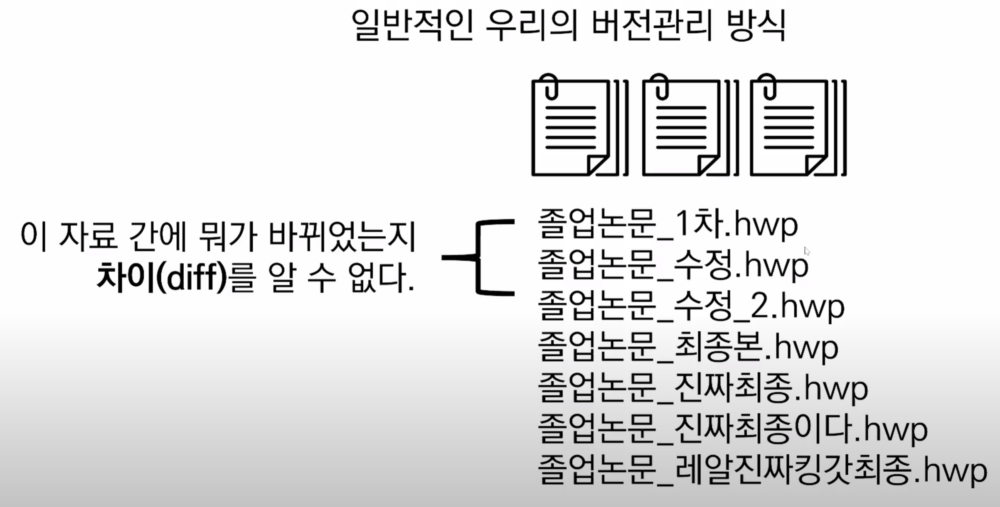
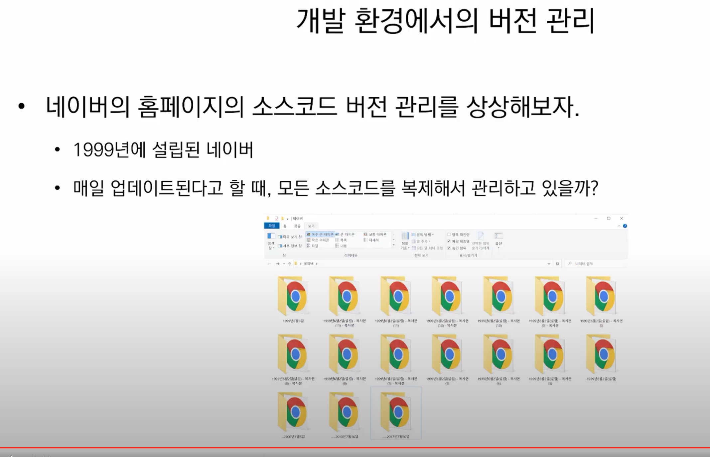
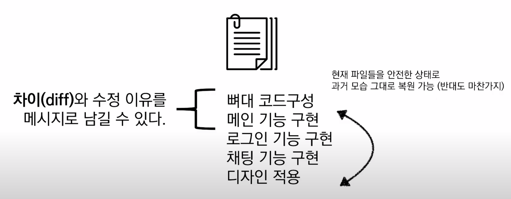

Git란 분산 버전 관리 시스템 이라고 할 수 있다.

버전 관리

버전 : 컴퓨터 소프트웨어의 특정 상태

우리가 알고있는 버전 관리

실제 오픈소스는?

- 크로미움(크롬 브라우저의 오픈소스)
    - 최신 버전의 용량 1.58GB
    - 현재까지 1,000,000여개의 커밋 20,000여개의 릴리즈
    

- Google Document 버전 관리
    - 문서는 하나지만 버전이 기록되어 있으면, 이전 시점을 조회하거나 복원시킬 수도 있음